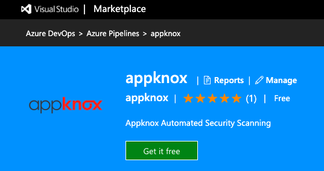
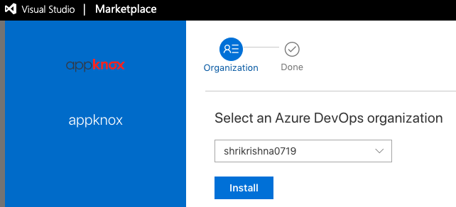
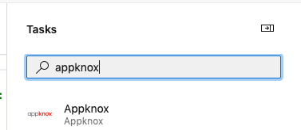
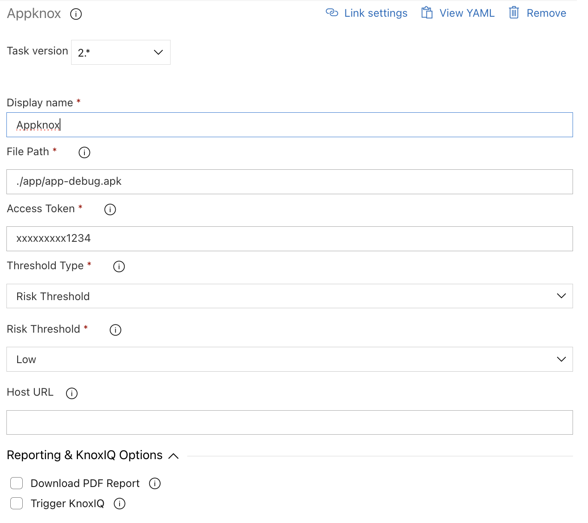
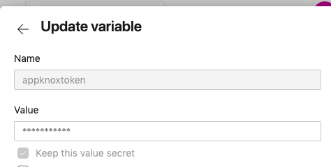
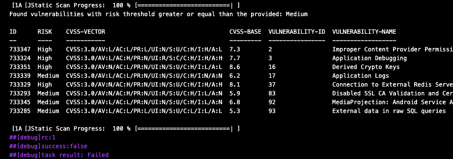

## Azure Extension for Appknox Automated Scanning
This extension adds the ability to perform automated app security testing for Android and iOS mobile apps through the [Appknox Platform](https://appknox.com).

## Task Parameters
Following are parameters needed for the task:

| param                   | required? | description                                                                                                                                              |
|-------------------------|:---------:|----------------------------------------------------------------------------------------------------------------------------------------------------------|
| `filePath`              |   true    | Path to APK/IPA binary file                                                                                                                              |
| `accessToken`           |   true    | Appknox API Access Token                                                                                                                                 |
| `thresholdType`         |   true    | Which threshold to enforce. `risk` requires `riskThreshold`; `healthScore` requires `healthScoreThreshold`; `exploitLikelihood` requires `exploitLikelihoodThreshold`. Defaults to `risk`       |
| `riskThreshold`         |   true    | Risk level to fail the build. Available options are: `Low`, `Medium`, `High`, `Critical`. Required when `thresholdType` is `risk`                        |
| `healthScoreThreshold`  |   true    | Health score threshold (0-100) to pass the command. Required when `thresholdType` is `healthScore`                                                       |
| `exploitLikelihoodThreshold` |   true    | Minimum KnoxIQ exploit-likelihood level for which the build should fail, based on real-world exploitability rather than raw CVSS severity. Available options are: `Low`, `Medium`, `High`. Required when `thresholdType` is `exploitLikelihood`. Automatically requests KnoxIQ triage during upload regardless of `triggerKnoxiq` -- this gate only works against triaged results |
| `host`                  |   false   | Specify the Appknox host url. Leave blank to use the default                                                                                             |
| `generatePdfReport`     |   false   | If enabled, the PDF report and its password file will be downloaded to reports/[file-id]/ in the working directory and published as a pipeline artifact named `reports`. Defaults to `false` |
| `triggerKnoxiq`         |   false   | If enabled, KnoxIQ triage is requested during upload and its results are reflected by the CI check. Forced on automatically when `thresholdType` is `exploitLikelihood`. Defaults to `false`                                   |

## Installation

<details>
  <summary>Install Appknox plugin to your Azure organization</summary>
  <ol>
  <li>Click on <strong>Get it free</strong><br></li>
  <li>Select your organization and Install <br></li>
  <ol>
</details>

### Add Appknox Task to your Azure Pipeline

1. From Azure Pipelines Edit page Search for the `Appknox` task in the Tasks tab.

    

2. Configured the required params.

    

3. `$(appknoxtoken)` is a build variable with its lock enabled on the Variables tab.

    

    [For more information about Variables](https://docs.microsoft.com/en-us/azure/devops/pipelines/process/variables?view=azure-devops&tabs=yaml%2Cbatch)

4. \[Optional\] **Using Proxy**: Appknox task requests can be routed via a web proxy server, which can be configured in environmental variable `HTTP_PROXY` or `HTTPS_PROXY` in the format `http(s)://username:password@hostname:port`. It fallbacks to azure pipeline [agent's proxy](https://docs.microsoft.com/en-us/azure/devops/pipelines/agents/proxy) if not set.


#### View Output logs

The above task will upload the binary which will initiate Appknox automated scanning. The progress can be viewed in the pipeline build logs.



---

## Examples

### Pipeline for Android
```

# Android
# Build your Android project with Gradle.
# Add steps that test, sign, and distribute the APK, save build artifacts, and more:
# https://docs.microsoft.com/azure/devops/pipelines/languages/android

trigger:
- master

pool:
  vmImage: 'macos-latest'

steps:
- task: Gradle@2
  inputs:
    workingDirectory: ''
    gradleWrapperFile: 'gradlew'
    gradleOptions: '-Xmx3072m'
    publishJUnitResults: false
    testResultsFiles: '**/TEST-*.xml'
    tasks: 'assembleDebug'

- task: appknox@2
  inputs:
    filepath: './app/build/outputs/apk/debug/app-debug.apk'
    accessToken: '$(appknoxtoken)'
    thresholdType: 'risk'
    riskThreshold: 'medium'
    host: 'https://secure.appknox.com/'
```

### Using Health Score Threshold
```
- task: appknox@2
  inputs:
    filepath: './app/build/outputs/apk/debug/app-debug.apk'
    accessToken: '$(appknoxtoken)'
    thresholdType: 'healthScore'
    healthScoreThreshold: '70'
    host: 'https://secure.appknox.com/'
```

**Note:** `thresholdType` selects which threshold is enforced. Set it to `risk` and provide `riskThreshold`, `healthScore` and provide `healthScoreThreshold`, or `exploitLikelihood` and provide `exploitLikelihoodThreshold`.

### Using Exploit Likelihood Threshold
```
- task: appknox@2
  inputs:
    filepath: './app/build/outputs/apk/debug/app-debug.apk'
    accessToken: '$(appknoxtoken)'
    thresholdType: 'exploitLikelihood'
    exploitLikelihoodThreshold: 'high'
    host: 'https://secure.appknox.com/'
```

**Note:** Exploit Likelihood gates on KnoxIQ's real-world exploitability assessment instead of raw CVSS risk. It requires KnoxIQ triage to complete for the uploaded file, so `--knoxiq` is always passed on upload when this threshold type is selected -- `triggerKnoxiq` is ignored in this mode regardless of its checkbox value (the classic designer UI does not grey it out, since Azure Pipelines tasks have no declarative way to disable one input based on another's value -- this is enforced in code, not the UI). If KnoxIQ triage is unavailable or does not complete in time, the task falls back to a risk check at `LOW` -- any Low-or-higher finding fails the build, regardless of which Exploit Likelihood level was configured. Check the pipeline logs for which gate actually ran.

### Requesting KnoxIQ Triage
```
- task: appknox@2
  inputs:
    filepath: './app/build/outputs/apk/debug/app-debug.apk'
    accessToken: '$(appknoxtoken)'
    thresholdType: 'risk'
    riskThreshold: 'medium'
    host: 'https://secure.appknox.com/'
    triggerKnoxiq: true
```

### Downloading a PDF Report
```
- task: appknox@2
  inputs:
    filepath: './app/build/outputs/apk/debug/app-debug.apk'
    accessToken: '$(appknoxtoken)'
    thresholdType: 'risk'
    riskThreshold: 'medium'
    host: 'https://secure.appknox.com/'
    generatePdfReport: true
```

