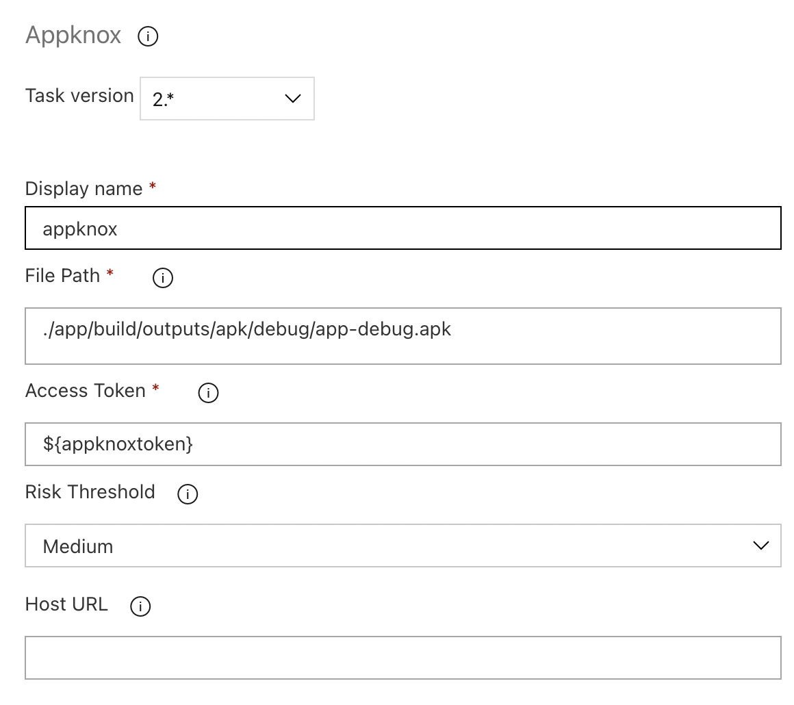

## Appknox Azure Extension For Auto Security Testing
This extension adds the ability to perform automatic mobile app security testing for Android and iOS mobile apps through the Appknox Automatic Security Testing Platform.

## Job Parameters
Following are parameters needed for the job:
- filepath: mandatory parameter to specify mobile binary.
- accessToken: Appknox API Access Token which can be obtained from Account Settings -> Developer Settings in the Appknox Dashboard.
- riskThreshold: riskThreshold to fail the build. Avialable options are: low, medium, high, critical.

### Installation

Find it in [Azure Devops Marketplace](https://marketplace.visualstudio.com/azuredevops) using "Appknox Security Test"


Then install it to your organization:


#### Add to your Build

Search for the Appknox Security Test task in the Tasks tab.


#### Basic Config

Configure the values of the variables needed.

Note: riskThreshold is an optional value. If it is not provided the task will only upload the binary
      to the Appknox dashboard but the build will not fail when the static scan is completed.


#### Env Variable

The above configuration uses env variable `$access_token`, please set the value of it in the variables tab.


#### Sample Build Pipeline for Android
```
# Android
# Build your Android project with Gradle.
# Add steps that test, sign, and distribute the APK, save build artifacts, and more:
# https://docs.microsoft.com/azure/devops/pipelines/languages/android

trigger:
- master

pool:
  vmImage: 'macos-latest'

steps:
- task: Gradle@2
  inputs:
    workingDirectory: ''
    gradleWrapperFile: 'gradlew'
    gradleOptions: '-Xmx3072m'
    publishJUnitResults: false
    testResultsFiles: '**/TEST-*.xml'
    tasks: 'assembleDebug'

- task: appknox-security-test@0
  inputs:
    filepath: './app/build/outputs/apk/app-debug.apk'
    accessToken: '$(access_token)'
    riskThreshold: 'medium'
```

#### View Output logs

