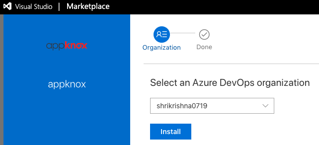

## Azure Extension for Appknox Automated Scanning
This extension adds the ability to perform automated app security testing for Android and iOS mobile apps through the [Appknox Platform](https://appknox.com).

## Task Parameters
Following are parameters needed for the task:

|param      | required? | description |
| ------------- |:-------------:| ----- |
| `filePath` | true | Path to APK/IPA binary file |
|`accessToken`| true | Appknox API Access Token |
|`riskThreshold`| true | Risk level to fail the build. Available options are: `Low`, `Medium`, `High`, `Critical`. Defaults to `Low` |

## Installation

<details>
  <summary>Install Appknox plugin to your Azure organization</summary>
  <ol>
  <li>Click on <strong>Get it free</strong><br></li>
  <li>Select your organization and Install <br></li>
  <ol>
</details>

### Add Appknox Task to your Azure Pipeline

1. From Azure Pipelines Edit page Search for the `Appknox` task in the Tasks tab.

    

2. Configured the required params.

    

3. `$(appknoxtoken)` is a build variable with its lock enabled on the Variables tab.

    

    [For more information about Variables](https://docs.microsoft.com/en-us/azure/devops/pipelines/process/variables?view=azure-devops&tabs=yaml%2Cbatch)

4. \[Optional\] **Using Proxy**: Appknox task requests can be routed via a web proxy server, which can be configured in environmental variable `HTTP_PROXY` or `HTTPS_PROXY` in the format `http(s)://username:password@hostname:port`. It fallbacks to azure pipeline [agent's proxy](https://docs.microsoft.com/en-us/azure/devops/pipelines/agents/proxy) if not set.


#### View Output logs

The above task will upload the binary which will initiate Appknox automated scanning. The progress can be viewed in the pipeline build logs.


---

## Examples

### Pipeline for Android
```

# Android
# Build your Android project with Gradle.
# Add steps that test, sign, and distribute the APK, save build artifacts, and more:
# https://docs.microsoft.com/azure/devops/pipelines/languages/android

trigger:
- master

pool:
  vmImage: 'macos-latest'

steps:
- task: Gradle@2
  inputs:
    workingDirectory: ''
    gradleWrapperFile: 'gradlew'
    gradleOptions: '-Xmx3072m'
    publishJUnitResults: false
    testResultsFiles: '**/TEST-*.xml'
    tasks: 'assembleDebug'

- task: appknox@1
  inputs:
    filepath: './app/build/outputs/apk/debug/app-debug.apk'
    accessToken: '$(appknoxtoken)'
    riskThreshold: 'medium'
```
